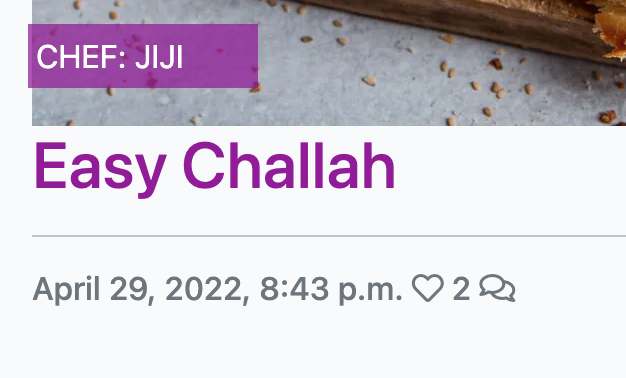

# Portfolio Project 4 - Food Mood
## Purpose

Food Mood is a Django application for food lovers.

The users can read recipes, like and comment on them.

This application was created for the purpose of completing the Portfolio 4 for the Code Institute's Full Stack Developer course and is entirely fictional.
The project covers Full Stack framework with a user centric approach in mind.  A full list of technologies used can be found in the technologies section of this document.

Here is the live version of my project. [here](https://foodupmood.herokuapp.com/)

## User Experience (UX)
The user can chech the website for new recipes and see the likes and comments on each recipe to get a better review. The user can also login to be able to like recipes as well as comment on them. The user will be able to update their comments and delete them as well.

### User stories
* As a user, I want to be able to read recipes
* As a user, I want to be able to register, login and logout
* As a user, I want to be able to like and comment 
* As a user, I want to be able to remove my likes and comments 
* As a user, I want to be able to get notificatitons when I login or logout as well when I post a comment

#### First Time Visitor Goals
* Get some nice cooking recipes
* Having a list view of all recipes as well as seperated detailed recipes view
* Register and login, for more interaction

#### Returning Visitor Goals
* A returning user is to give feedback on a tried recipe, or to try another one

#### Frequent Visitor Goals
* Frequent visitors will create a community of food lovers that can share their own ideas and opinions about recipes and help others byt replying to their problems

### Languages used
* HTML, CSS, JavaScript, Python+Django
* Relational database (recommending MySQL or Postgres)

## Features
* The user can register, login or logout

* As well as they get notifications messages when they do or when they comment

* The user can see details of the recipe author and date created as well as the count of likes and comments of each recipe on the main page with the list view of all recipes

* The authenticated user can like/dislike and comment on recipes

* A non-registered user can only read comments and see how many likes each recipe has

* The footer has external links to social media accounts

## Future features:
- Add videos to the recipes
- Rate recipes
- Search for specific food
- Reply on other users comments
- Give users the ability to create a recipe

### Testing

I have manually tested this project by doing the following:
- Tested in my local terminal and the Keroku terminal.

### Bugs
## Solved Bugs
- Getting the comments to show on the recipe_detail.html as well being able to write one

## Remaining Bugs
- Updating and deleting comments are not set yet as part of the CRUD functionality

## Validator Testing
- PEP8
    - No errors were returned from PEP8online.com

### Deployment

This project was deployed using Heroku.
- Steps for deployment:
    - Fork or clone this repository
    - Create a new Heroku app
    - Set the buildbacks to Python and NodeJS in that order
    - Link the Heroku app to the repository
    - Click on Deploy

### Frameworks, Libraries & Programs used
* [GitHub](https://github.com/)
	* GithHub is the hosting site used to store the source code for the Website and [Git Pages](https://pages.github.com/) is used for the deployment of the live site.
* [GitPod](https://gitpod.io/)
	* GitPod is used as version control software to commit and push code to the GitHub repository where the source code is stored.
* [Am I Responsive?](http://ami.responsivedesign.is/)
	* Used to generate the screenshots for responsive design.

### Credits
- www.delish.com for the recipes and images
- To my Mentor [Chris Quinn](https://github.com/10xOXR) who has been an exceptional help throughout the course, so far.
